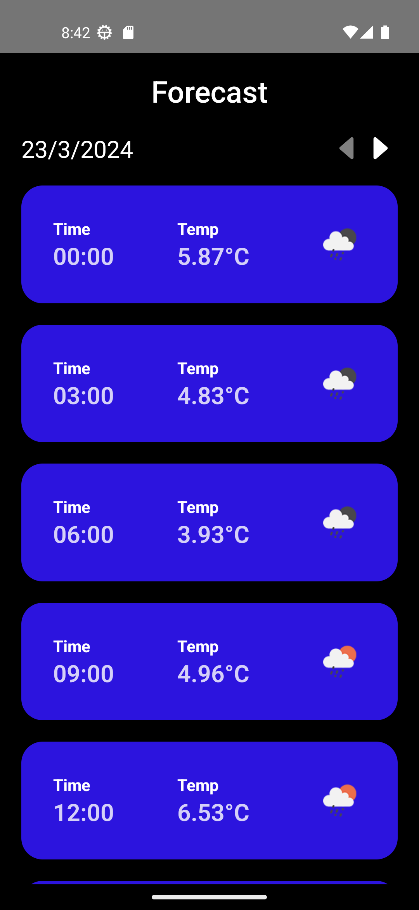
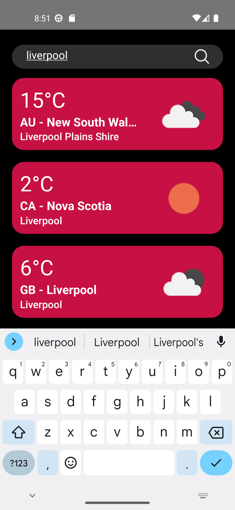

# Weather app
Weather app built with React Native.

## Features
* City search
* Show weather info, such as:
   - Min temperature.
   - Max temperature.
   - Temperature.
   - Cloudiness.
   - Visibility.
   - Humidity.
   - Atmospheric pressure.
   - 5 day / 3 hour forecast.
 
## Installation
1. Clone the repository
```bash
git clone https://github.com/Fernando-LRz/weather-app.git
``` 
2. Navigate to the project directory
```bash
cd weather-app
```
3. Install dependencies
```bash
npm install
```

## Configuration
 * A GeoDB Cities API key and an OpenWeather API key are required, both must be added to a .env file. There is a sample .env file in the project.

## Run the app
```bash
npx react-native run-android
```

## App images
| Weather info                                                | Forecast                                                           | City search                                                 | 
| ----------------------------------------------------------- | ------------------------------------------------------------------ | ----------------------------------------------------------- | 
|     |           |      | 
